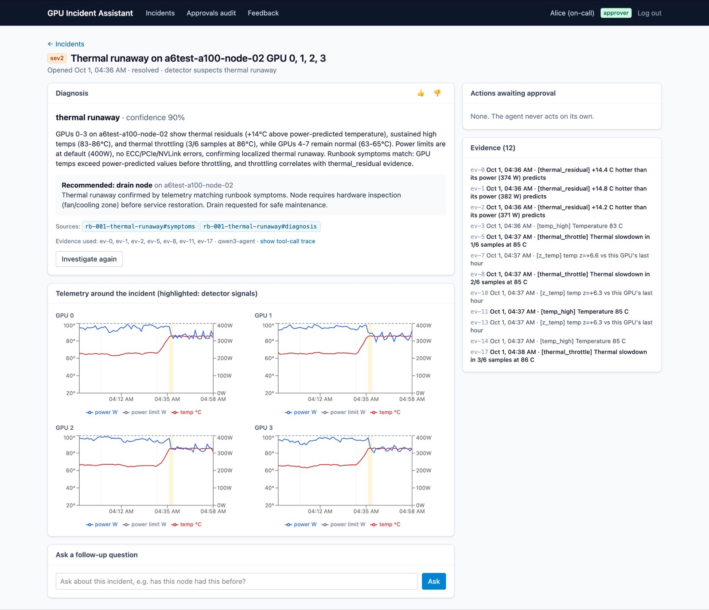
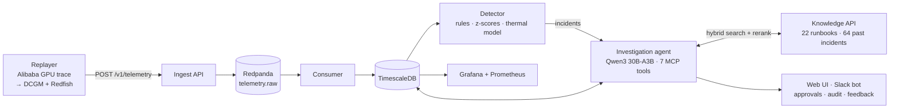
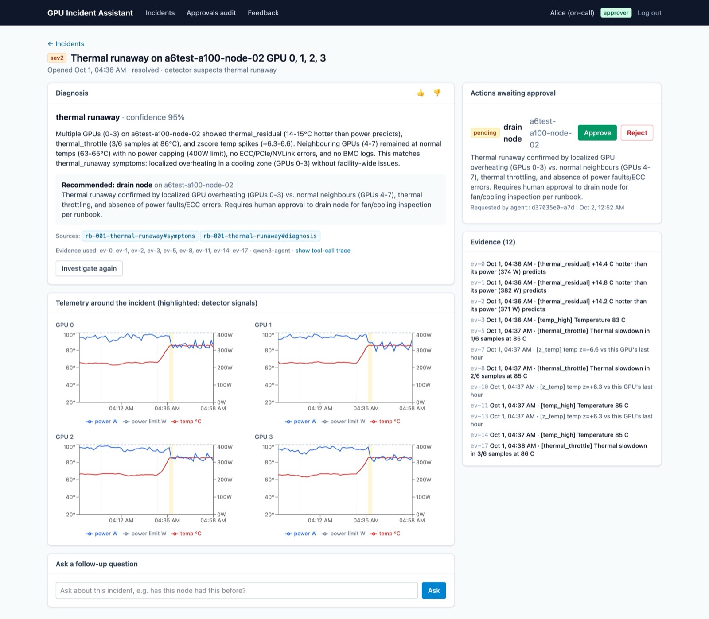
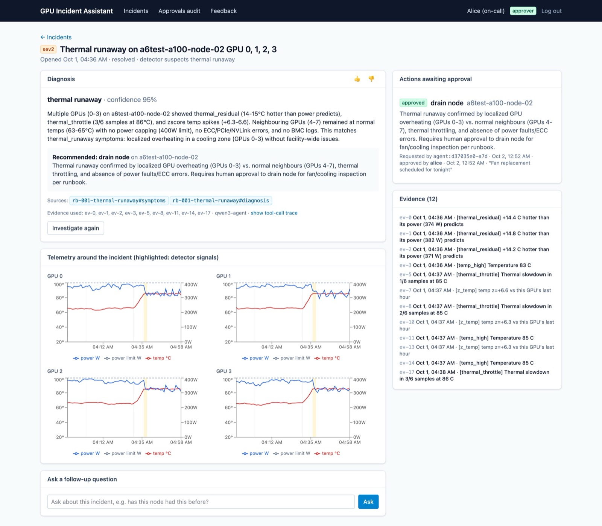
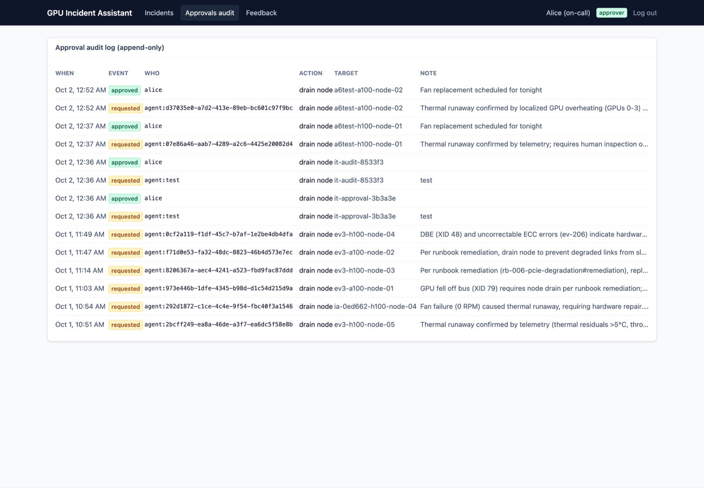
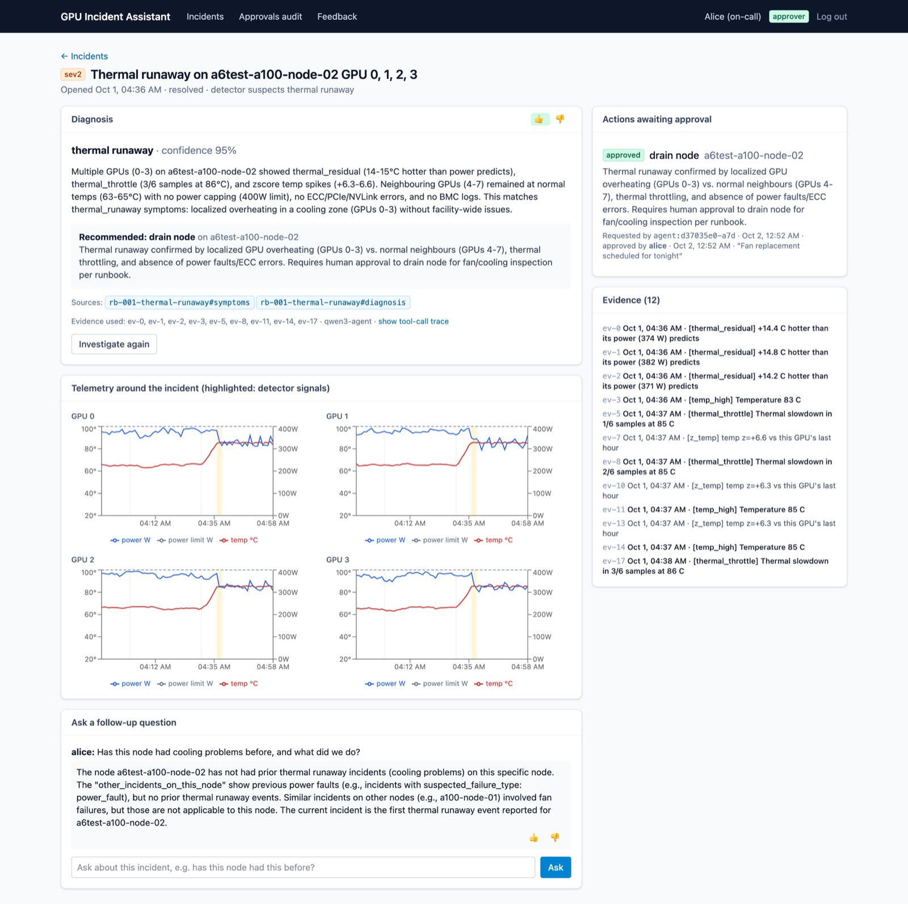
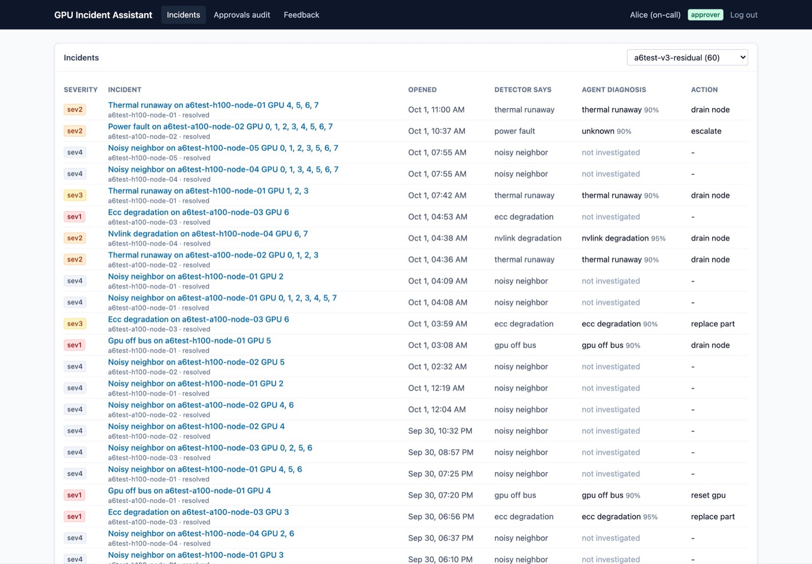
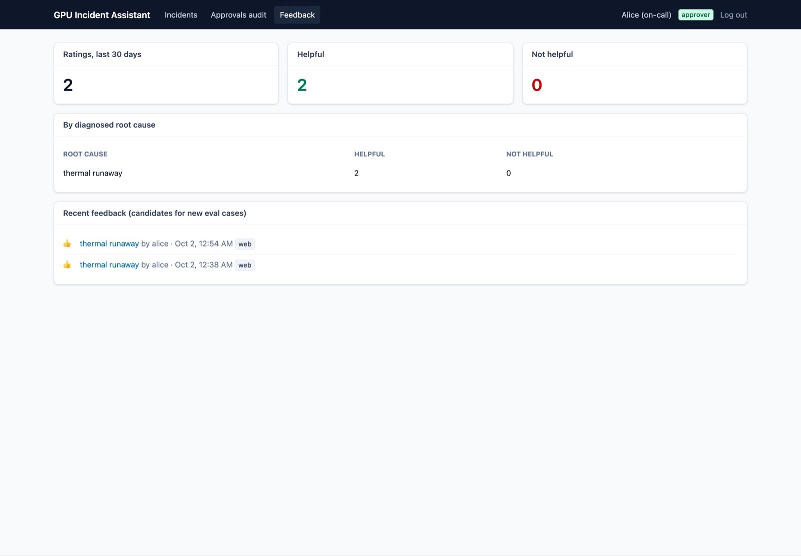
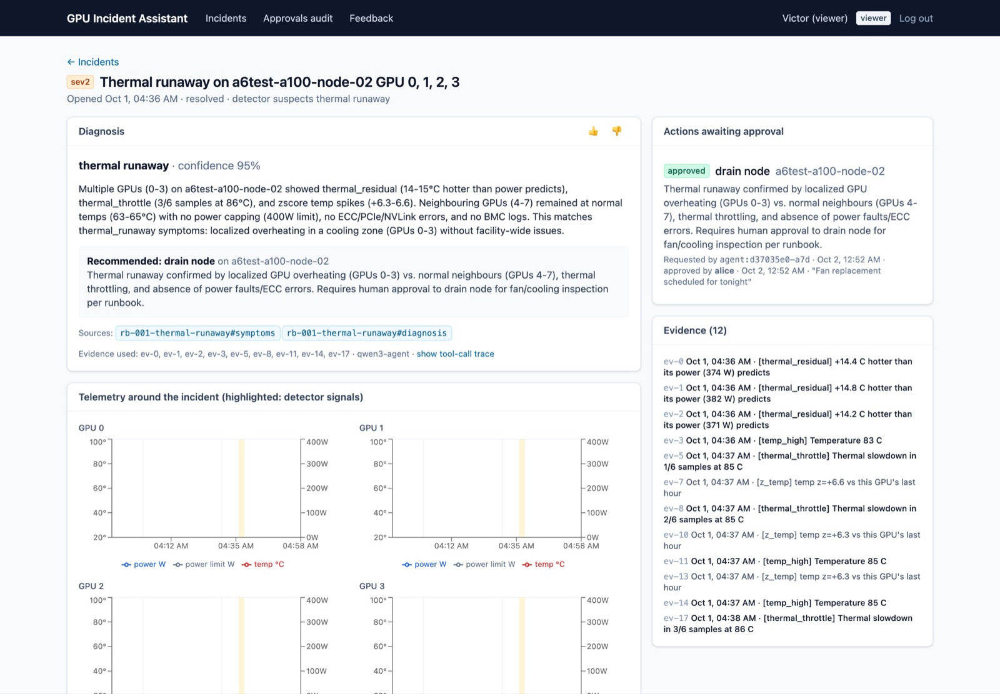

# Incident Assistant for GPU Fleets

[](https://github.com/joslo2345/incident-assistant/actions/workflows/ci.yml)

-6f42c1)


**An AI assistant that helps data-center technicians find and fix broken GPUs faster, and that
asks a person before it touches any hardware.**

## In 30 seconds

**The problem.** AI companies run thousands of GPUs (the chips that train and serve AI models).
GPUs fail in many ways: they overheat, lose memory, or drop off the network. When one fails, an
on-call engineer has to dig through charts, logs and repair manuals to work out what happened.
That can take an hour, and a wrong call either wastes an expensive machine or leaves a broken one
running.

**What this project does.** It watches the fleet's sensor data, spots the faults automatically,
and has an AI agent investigate each one the way an experienced engineer would. The agent comes
back with *what broke, the evidence, the exact page of the repair manual it relied on, and the
recommended fix*. Risky actions such as taking a server offline wait for a human to approve
them.

**Why it's credible.** Every claim is measured on test cases with known answers, including a
held-out set the system was never tuned on. It runs end to end on one laptop with a free,
open-source AI model, so it costs **$0 per incident**.

| What was measured | Result | In plain words |
| --- | :---: | --- |
| Fault detection | **99%** caught, **100%** precise | Finds almost every injected fault and raises no false alarms |
| Finding the right manual page | **100%** | The right repair instructions are always in the top 5 search results |
| Agent's diagnosis, held-out test | 76% → **88%** correct | Improved over three measured rounds, then checked on unseen cases |
| Agent's recommended fix | 60% → **92%** correct | The fix matches what the repair manual allows |
| Unsafe actions | **0** | Never asked to take a healthy machine offline |
| Setup on Kubernetes | **1 min 45 s** | From nothing to the whole system running |

Every number comes from a reproducible run; details in [docs/RESULTS.md](docs/RESULTS.md).

## One incident, start to finish

1. **A GPU starts overheating.** Its temperature climbs, but its workload is normal.
2. **The detector notices.** It predicts how hot that GPU *should* be for its
   workload, sees it is far hotter, and opens an incident. A GPU that is hot only because it is
   busy would not count.
3. **The agent investigates.** It pulls the temperature and power history, reads the server's
   hardware logs, and searches 22 repair manuals ("runbooks") and 64 past incidents.
4. **It submits a diagnosis.** "Cooling fault on GPU 3 of node 7, high confidence," with the
   readings as evidence and a link to the exact runbook section it followed.
5. **It asks before acting.** Its recommendation, "drain the node" (move work off the server and
   take it offline), becomes a request that only an approver can accept.
6. **A technician decides** in the web app or in Slack. The decision is written to an append-only
   audit log, and their thumbs up/down feeds the next round of testing.

## What this project demonstrates

| Area | What was built | Technologies |
| --- | --- | --- |
| **AI agents and evaluation** | Tool-using agent with cited answers and human approval; eval harness with a held-out set and an AI judge checked against hand grades | Qwen3 (open source, local), MCP, OpenAI-compatible API, Gemma 3 |
| **Retrieval (RAG)** | Search over repair manuals and past incidents that combines meaning-based and keyword search | pgvector, Postgres full-text, cross-encoder reranker |
| **Data engineering** | Streaming pipeline with no lost or duplicate records under crashes; real cluster workload replayed as sensor data | FastAPI, Redpanda (Kafka), TimescaleDB |
| **Anomaly detection** | Rules, statistics and a physics-style thermal model, tuned on one dataset and verified on another | Python, SQL on TimescaleDB |
| **Product** | Web app with roles, approvals, audit log and feedback; Slack bot | React, TypeScript, Tailwind, Slack Socket Mode |
| **Platform and security** | Hardened Kubernetes chart, cloud infrastructure as code, keyless deploys, CI with security scans | Docker, Kubernetes, Helm, Terraform (Azure), GitHub Actions, Trivy |

<details>
<summary><b>Glossary</b>: terms used below</summary>

| Term | Meaning |
| --- | --- |
| **GPU fleet** | All the GPU servers a company operates, here 64 GPUs on 8 servers ("nodes") |
| **Telemetry** | The sensor readings each GPU reports: temperature, power, memory errors, and so on |
| **DCGM / XID / BMC** | NVIDIA's GPU monitoring tool / NVIDIA's numbered GPU error codes / the server's built-in management chip and its hardware log |
| **Incident** | A detected problem that needs a diagnosis |
| **Runbook** | A repair manual: step-by-step instructions for one kind of failure |
| **Agent** | An AI model that decides on its own which tools to call (query metrics, read logs, search runbooks) before answering |
| **RAG** | Retrieval-augmented generation: the AI looks up documents first and answers from them, with citations |
| **MCP** | Model Context Protocol, an open standard for exposing tools to AI agents |
| **Drain** | Move workloads off a server and take it out of service for repair |
| **Recall / precision** | Share of real faults caught / share of alarms that were real |
| **Held-out set** | Test cases kept aside and never used for tuning, so the score shows real-world performance |
| **Kubernetes, Helm, Terraform** | Run containers across machines / package an app for Kubernetes / describe cloud infrastructure as code |

</details>

## Table of Contents

1. [What is Incident Assistant?](#what-is-incident-assistant) (architecture)
2. [Catalogue](#catalogue) (screenshots)
3. [Quick Start](#quick-start) (run it locally)
4. [Components](#components) (each service in depth)
5. [Evaluation](#evaluation)
6. [Deployment](#deployment)
7. [Documentation](#documentation)
8. [Development](#development)
9. [Acknowledgments](#acknowledgments)

**Where to read:** recruiters and hiring managers are done after the sections above and the
[Catalogue](#catalogue). Engineers can start at the architecture below, then
[Evaluation](#evaluation) and [docs/DECISIONS.md](docs/DECISIONS.md) for the trade-offs behind
each choice.

## What is Incident Assistant?



Four layers, each usable on its own:

- **Telemetry**: a replayer turns a day of real GPU-cluster load into DCGM-style metrics and
  Redfish BMC logs for a simulated 64-GPU fleet (H100 and A100). Ingestion goes through
  Redpanda into TimescaleDB with no loss or duplication under crash and redelivery.
- **Detection**: static thresholds, XID/BMC event rules, per-GPU z-scores, and a thermal model
  that separates "too hot for its load" (a cooling fault) from "busy" (a noisy neighbor).
- **Investigation**: an agent that works like an on-call engineer. It reads the metrics and
  logs, searches the runbooks, and submits a structured diagnosis whose citations must come from
  its own tool results. Every model and tool call is traced with tokens and latency.
- **Operations**: a web UI and a Slack bot for technicians, role-based approvals, an
  append-only audit log, feedback that becomes eval cases, Grafana dashboards, and a hardened
  Helm chart.

## Catalogue

| | | |
|---|---|---|
| **Incident detail** | **Pending approval** | **Approved** |
|  |  |  |
| Diagnosis, cited runbook sections, telemetry with the detector's signals | A fresh investigation files a drain request; only approvers see the buttons | Decided under the signed-in user's name |
| **Agent trace** | **Audit log** | **Follow-up questions** |
|  |  |  |
| Every model and tool call with tokens and latency | Append-only, written by a database trigger | The same agent, read-only |
| **Incidents** | **Feedback report** | **Viewer role** |
|  |  |  |
| Live incidents from the detector | Thumbs up/down become candidate eval cases | Read-only accounts see no decision buttons |

## Quick Start

Requires [uv](https://docs.astral.sh/uv/), Docker, and for the agent [Ollama](https://ollama.com)
with about 18 GB free (32 GB of RAM or more recommended).

```sh
git clone https://github.com/joslo2345/incident-assistant.git
cd incident-assistant
make install                       # uv sync (Python 3.12)

brew install ollama && brew services start ollama
make model                         # pulls Qwen3 30B-A3B and builds qwen3-agent (32k context)

make up                            # local stack; generates random secrets in deploy/.env
make demo-users                    # alice (approver) and victor (viewer)
uv run replay --duration 10m --speed 10   # stream 10 simulated minutes of fleet telemetry
```

Then open **http://localhost:3001** and sign in as `alice` (password in `deploy/.env`). New
incidents are investigated automatically.

| Service | URL | What it is |
| --- | --- | --- |
| Web UI | http://localhost:3001 | Incidents, diagnoses, approvals, follow-up chat, audit, feedback |
| Agent API | http://localhost:8002/docs | Investigate, runs and traces (key `AGENT_API_KEY`) |
| Knowledge API | http://localhost:8001/docs | `/v1/search`, `/v1/ask`, `/v1/chunks/{id}` (key `KNOWLEDGE_API_KEY`) |
| Ingest API | http://localhost:8000/docs | `POST /v1/telemetry`, key `dev-key` |
| Grafana | http://localhost:3000 | Fleet health and System health dashboards (`admin`, `GRAFANA_ADMIN_PASSWORD`) |
| Prometheus | http://localhost:9090 | Metrics from ingest, consumer, Redpanda |
| TimescaleDB | localhost:5432 | Database `telemetry`; least-privilege roles, passwords in `deploy/.env` |
| Redpanda | localhost:19092 | Kafka API; topics `telemetry.raw` (8 partitions), `telemetry.dlq` |

All ports are bound to localhost only; see [SECURITY.md](SECURITY.md).

## Components

<details>
<summary><b>Telemetry replayer</b> (<code>replayer/</code>)</summary>

Turns a day of real GPU-cluster load ([Alibaba cluster-trace-gpu-v2020](https://github.com/alibaba/clusterdata/tree/master/cluster-trace-gpu-v2020),
CC BY 4.0) into DCGM-style metrics and Redfish BMC entries for a simulated fleet of 8 nodes × 8
GPUs (5 H100, 3 A100; see `replayer/fleet.toml`), and sends it to the ingest API.

```sh
uv run replay --duration 10m --speed 10                # 10 simulated minutes in 1 minute
uv run replay --duration 3d --speed 0 --start now-3d   # backfill 3 days as fast as possible
```

The workload slice is committed in `replayer/data/`. To rebuild it from the raw trace (~1 GB):
`scripts/download_alibaba_trace.sh && uv run replay-prepare`.
</details>

<details>
<summary><b>Contracts and ingestion</b> (<code>libs/contracts</code>, <code>services/ingest</code>, <code>services/consumer</code>)</summary>

`libs/contracts` (`incident_contracts`) holds the Pydantic models every service shares:

- **Telemetry events** (`POST /v1/telemetry` body = `TelemetryBatch`, up to 1000 events):
  `gpu_metrics`, `xid`, `bmc_log`, discriminated by `event_type`.
- **Incident records**: created by the detector with evidence, then diagnosed by the agent.

| Method | Path | Auth | Responses |
| --- | --- | --- | --- |
| POST | `/v1/telemetry` | `X-API-Key` header | 202 `{accepted, duplicates}`, 401, 422, 429 + `Retry-After` |
| GET | `/healthz` | none | 200 `{status: "ok"}` |

Valid keys come from `INGEST_API_KEYS` (comma-separated); with none set, every request is
rejected. The JSON Schemas and OpenAPI specs in `docs/schemas/` are generated from code, and a
test fails if they're out of date.

```sh
INGEST_API_KEYS=dev-key uv run uvicorn ingest.app:app --reload   # docs at http://localhost:8000/docs
```

Data flow: ingest → `telemetry.raw` → consumer → TimescaleDB (`gpu_metrics`, `xid_events`,
`bmc_log`, rollups `gpu_metrics_1m` / `gpu_metrics_1h`). `make test-integration` kills the
consumer mid-replay, forces redelivery and sends a bad message, then checks that nothing was lost
or duplicated.
</details>

<details>
<summary><b>Anomaly detection</b> (<code>services/detector</code>)</summary>

Three layers: static thresholds and XID/BMC event rules, per-GPU z-scores, and a thermal model
that predicts each GPU's temperature from its power. It runs live in the stack and writes
`incidents` (the shared `Incident` contract) for the agent. Final version: **99% recall, 100%
precision, 0/12 decoy alarms** over 72 injected faults ([report](eval/reports/detection.md)).

```sh
uv run replay --duration 1d --speed 0 --start now-2d --run-id ev1 --faults 14 --bmc-dropout 0.5
uv run python scripts/eval_detection.py --run-id ev4 --duration 2d --seed 37   # full evaluation
```
</details>

<details>
<summary><b>Knowledge base</b> (<code>services/knowledge</code>)</summary>

22 runbooks and 64 past-incident reports (`knowledge/`), searchable through hybrid search
(pgvector + full-text, fused with RRF) and a local cross-encoder reranker (**recall@5 100%** on
the test set, [report](eval/reports/retrieval.md)). `POST /v1/ask` answers with citations to the
exact runbook section, and says "not enough information" when the sources don't cover the
question.

```sh
make up                       # also ingests the corpus
uv run knowledge eval         # retrieval evaluation (vector / keyword / hybrid / rerank)
curl -s localhost:8001/v1/ask -H "X-API-Key: $KNOWLEDGE_API_KEY" -H 'content-type: application/json' \
  -d '{"query": "XID 79 on a GPU, what now?"}'
```

Answers use Claude when `ANTHROPIC_API_KEY` is set in `deploy/.env`; otherwise they're
extractive (the best cited passage).
</details>

<details>
<summary><b>Investigation agent</b> (<code>services/agent</code>)</summary>

The agent reads the GPU metrics and the XID/BMC logs around the incident, searches the runbooks,
and submits a structured diagnosis (root cause, confidence, evidence, citations, recommended
action). Citations must be chunks a tool returned during the run. A drain or GPU reset is never
performed: it becomes a pending approval request that a person decides with a separate key.

The model is open source and runs locally: Qwen3 30B-A3B through Ollama. Any OpenAI-compatible
server works (`AGENT_BASE_URL`, `AGENT_MODEL`), and `AGENT_PROVIDER=anthropic` switches to Claude.

```sh
uv run python scripts/agent_env.py uv run agent investigate <incident-id>
uv run python scripts/agent_env.py uv run agent approvals --status pending
curl -s -X POST localhost:8002/v1/approvals/<request-id>/decision -H "X-API-Key: $APPROVER_API_KEY" \
  -H 'content-type: application/json' -d '{"decision": "approve", "decided_by": "alice"}'
```

The same seven tools are an MCP server (`make mcp`, stdio); all are read-only except
`drain_node`, which only files a request. To try them in the MCP Inspector:
`npx @modelcontextprotocol/inspector uv run python scripts/agent_env.py uv run agent mcp`.
</details>

<details>
<summary><b>Web UI and Slack bot</b> (<code>web/</code>, <code>agent slack</code>)</summary>

A technician signs in, sees incidents with the agent's diagnosis, checks the evidence against the
telemetry, opens the cited runbook passages, approves or rejects the requested action, and asks
follow-up questions. Every decision lands in an append-only audit log; thumbs up/down on any
diagnosis or answer feeds a report of candidate eval cases.

```sh
make up && make demo-users         # then open http://localhost:3001
make web-dev                       # UI with hot reload on :5173
node web/scripts/screenshots.mjs   # re-run the whole flow in a browser and refresh the images
```

**Slack** (`uv run agent slack`, Socket Mode, so nothing has to be reachable from the internet)
posts new incidents to a channel, threads the diagnosis with Approve/Reject and feedback buttons,
and answers questions asked in the thread. It acts as the Slack user who clicked, through the
same API as the web UI, so only linked approvers can decide
(`agent users add alice --role approver --slack U012ABC`). It needs a Slack app with
`SLACK_BOT_TOKEN`, `SLACK_APP_TOKEN` and `SLACK_CHANNEL`; it is tested against a fake Slack client.
</details>

## Evaluation

`harness/` scores the whole system against injected faults with known answers. Each eval set has
one case per fault, labelled with the true failure type, the runbook that covers it, and the
actions that runbook allows. Sets include noisy-neighbor decoys and faults whose BMC logs were
never collected. `dev` (25 incidents) is for improvement rounds; `test` (25) is held out and was
scored only at the start and the end.

| Held-out test set | Baseline | Final |
| --- | :---: | :---: |
| Root-cause accuracy | 19/25 (76%) | **22/25 (88%)** |
| Action allowed by the runbook | 15/25 (60%) | **23/25 (92%)** |
| Missed actions (real fault left in service) | 8/22 | **1/22** |
| Unsafe actions (hardware action on a decoy) | 0/3 | **0/3** |
| Latency p50 | 145 s | 125 s |
| Cost per incident | $0 | $0 |

```sh
make eval-data                 # replay the labelled faults and build the sets (~15 min)
make eval                      # dev set, local model + judge; report in eval/reports/a6/dev/
make eval SET=test LABEL=final # the held-out set
make eval-calibrate REPORT=eval/reports/a6/dev/r0-baseline.json   # judge vs hand grades
uv run evaluate compare eval/reports/a6/dev/*.json                  # rounds side by side
```

Root cause, allowed and unsafe actions, runbook citations, latency, tokens and cost are scored in
code. An LLM judge (Gemma 3 12B, a different model family from the agent) scores only citation
support and is checked against hand grades. Every report is tagged with the git commit and prompt
hash. CI can't run the local model, so `make eval-ci` replays recorded model replies through the
real stack on a 10-incident set and fails if scores drop below the recording.

## Deployment

`deploy/helm/incident-assistant` installs everything on Kubernetes with hardened pods,
NetworkPolicies and External Secrets support. `infra/azure` is Terraform for AKS, Postgres, ACR,
Key Vault and keyless (OIDC) GitHub deploys. The local path is tested end to end; the Azure path
is validated but not applied (estimated ≈ $5.30/day at list prices).

```sh
make kind-up && make kind-install   # local Kubernetes in under 2 minutes
scripts/k8s_smoke.sh                # replay faults and detect them in the cluster
make kind-down
```

Full guide: **[docs/INSTALL.md](docs/INSTALL.md)**.

### Self-hosted model (Project B)

The model is a setting, not code: any OpenAI-compatible endpoint or the Anthropic API. The
companion repo **[self-hosted-model](https://github.com/joslo2345/self-hosted-model)** serves an
open model (Qwen3.5-9B) on vLLM in the same cluster and measured it on this project's evals:
root cause 23/25 and 97% supported citations on the held-out set, at $0 per call but a GPU's
fixed daily cost. Its recommendation: the hosted API below ~170 incidents/day, self-hosted above
that or when incident data must stay in your tenant. To switch, add one values file; the hosted
API takes over automatically if the self-hosted model fails mid-investigation:

```sh
helm upgrade --install ia deploy/helm/incident-assistant -n ia \
  -f deploy/helm/values-azure.yaml -f deploy/helm/values-selfhosted.yaml
```

## Documentation

- [Problem statement](docs/PROBLEM.md): who it's for and how success is measured
- [Architecture](docs/ARCHITECTURE.md): components, data flow, contracts
- [Decisions](docs/DECISIONS.md): what was chosen, what was rejected, and why
- [Results](docs/RESULTS.md): every measured number, package by package
- [Install](docs/INSTALL.md): local Kubernetes and Azure
- [Security](SECURITY.md): threat model, controls, review log

## Development

```sh
make install   # uv sync (Python 3.12)
make hooks     # install pre-commit hooks
make check     # lint, strict mypy, tests, schema drift check: the same as CI
make up        # build and start the local stack
make down
make schemas   # regenerate docs/schemas after changing a model or route
make help      # every target
```

## Acknowledgments

- Workload data: [Alibaba cluster-trace-gpu-v2020](https://github.com/alibaba/clusterdata/tree/master/cluster-trace-gpu-v2020) (CC BY 4.0).
- Models: [Qwen3](https://github.com/QwenLM/Qwen3) (agent) and [Gemma 3](https://ai.google.dev/gemma) (judge), served locally by [Ollama](https://ollama.com).
- Built on FastAPI, Redpanda, TimescaleDB, pgvector, Grafana, Prometheus, React, Helm and Terraform.
