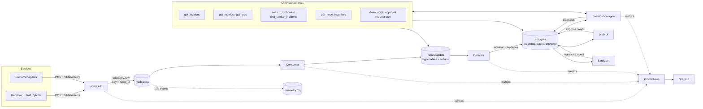

# Architecture

## Overview

The system watches a GPU fleet's telemetry, opens an incident when hardware looks unhealthy, and
has an agent investigate it with read-only tools and a runbook knowledge base. A technician then
reviews the cited diagnosis and approves or rejects any action that changes the fleet.

## Components

| Component | Package | Responsibility | Talks to |
| --- | --- | --- | --- |
| Replayer | A1, A3 | Turns public cluster traces into per-GPU telemetry at 1x–100x speed and injects labeled faults (ground truth in a file) | Ingest API |
| Ingest API | A0–A2 | Authenticates, validates and deduplicates batches, publishes to the stream and answers 202 only after Kafka acks; 429 when too many events are in flight, 503 if Kafka is down | Redpanda |
| Redpanda | A2 | Durable buffer between ingestion and storage. Kafka-compatible, lighter locally | Ingest, consumer |
| Consumer | A2 | Batches of up to 5000 messages: validate, send invalid ones to the DLQ, COPY + `ON CONFLICT DO NOTHING` into TimescaleDB, then commit offsets (at-least-once, idempotent) | Redpanda, TimescaleDB |
| TimescaleDB | A2 | Raw telemetry plus 1-minute and 1-hour continuous aggregates, with retention policies | Consumer, detector, MCP tools |
| Detector | A3 | Per-GPU minute features from raw telemetry; static thresholds and XID/BMC event rules, per-GPU z-scores, and a thermal residual model (temperature vs lag-filtered power); groups related alerts per node and component into classified incidents with evidence | TimescaleDB (`incidents`) |
| Knowledge base | A4 | 22 runbooks + past incidents in pgvector (`kb_chunks`); hybrid search (embeddings + full-text, RRF) with a local cross-encoder reranker; `/v1/ask` returns grounded, cited answers or refuses | Postgres, Claude (optional) |
| Agent + MCP server | A5 | Calls seven tools (served in-process and over MCP) within step, token and time budgets; submits a `Diagnosis` that is checked against the run (evidence on the incident, citations returned by tools); files approval requests for drains and resets; traces every model and tool call in `agent_runs` / `agent_steps`; investigates new live incidents automatically | TimescaleDB, knowledge API, approvals, model provider (local Qwen3 via Ollama by default) |
| Eval harness | A6 | Labelled sets of injected faults (dev, held-out test, CI); scores root cause, runbook-allowed actions, unsafe and missed actions, runbook citations, latency, tokens and cost in code; an LLM judge (calibrated against hand grades) for citation support; reports tagged with the commit; CI replays recorded model replies through the real stack | Everything |
| Web UI + Slack bot | A7 | Incident list and detail, approvals with an audit log, follow-up chat, feedback | Postgres, agent |
| Observability | A2 | Prometheus metrics from every service, Grafana dashboards provisioned as code | All services |

## Contracts

Every component shares one package of models, `libs/contracts`. Generated schemas are in
`docs/schemas/`.

- **Telemetry event** (`telemetry_batch.schema.json`): `gpu_metrics`, `xid` and `bmc_log`
  (Redfish `LogEntry` shape). Every event has a client `event_id` (idempotency), a timezone-aware
  `timestamp` and a `node_id`, which is also the Kafka partition key.
- **Incident** (`incident.schema.json`): the detector writes components and evidence. The agent
  produces a `Diagnosis` whose evidence references must exist on the incident and whose citations
  point to knowledge-base chunks it was shown; it's stored on the agent run (`agent_runs`), because
  the detector keeps rewriting the incident row.
- **Ingestion API** (`ingest.openapi.json`): `POST /v1/telemetry`, `GET /healthz`.
- **Agent** (`agent.openapi.json`, `agent_tools.json`): the API, and the tool definitions exactly
  as the model and MCP clients see them.

## Key properties

- **Ordering per node.** Events are partitioned by `node_id`, so one node's events stay in order.
  Nothing requires ordering across nodes.
- **No loss, no duplicates.** A 202 means the events are in Kafka. The consumer commits offsets only
  after the database commit, and inserts are idempotent on `(event_id, time)`, so retries and consumer
  crashes neither lose nor duplicate data. Integration tests SIGKILL the consumer and force redelivery to prove it.
- **The agent can't change the fleet.** Every tool is read-only except `drain_node`, which only
  creates an approval request. Whether an action needs approval comes from its type in the
  contract, not from the model, and the database enforces it: the agent's role can file requests
  but not decide them, and a decision is final.
- **Swappable model provider.** The agent talks to the model through one interface. Default: an
  open-source model (Qwen3 30B-A3B) served locally by Ollama over the OpenAI-compatible API; the
  same provider serves vLLM in Project B, and a Claude provider is built in.
- **Measured.** Every package records numbers in `RESULTS.md`; A6 makes the full scoring run
  one command (`make eval`).

## Deployment

- **Local (A0–A7):** Docker Compose (`deploy/compose.yaml`), started with `make up`.
- **Cloud (A8):** Helm chart plus Terraform for one managed Kubernetes cloud. Secrets come from the
  cloud's secret manager through External Secrets, deploys use OIDC from GitHub Actions, and images
  are scanned with Trivy.
