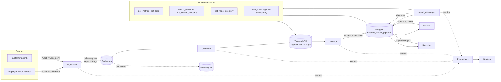

# Architecture

## Overview

The system watches a GPU fleet's telemetry, opens an incident when hardware looks unhealthy, and
has an agent investigate it with read-only tools and a runbook knowledge base. A technician then
reviews the cited diagnosis and approves or rejects any action that changes the fleet.

## Components

| Component | Package | Responsibility | Talks to |
| --- | --- | --- | --- |
| Replayer | A1, A3 | Turns public cluster traces into per-GPU telemetry at 1x–100x speed and injects labeled faults (ground truth in a file) | Ingest API |
| Ingest API | A0, A1 | Authenticates, validates and deduplicates batches, applies backpressure (429), publishes to the stream | Redpanda |
| Redpanda | A2 | Durable buffer between ingestion and storage. Kafka-compatible, lighter locally | Ingest, consumer |
| Consumer | A2 | At-least-once batch inserts into TimescaleDB, idempotent on `event_id`, sends bad events to the dead-letter topic | Redpanda, TimescaleDB |
| TimescaleDB | A2 | Raw telemetry plus 1-minute and 1-hour continuous aggregates, with retention policies | Consumer, detector, MCP tools |
| Detector | A3 | Thresholds, per-GPU rolling z-scores and event matching (XID, critical BMC entries), then groups related alerts into one incident with evidence windows | TimescaleDB, Postgres |
| Knowledge base | A4 | Runbooks, vendor docs and past incidents, chunked by heading, hybrid search (vector + keyword) plus reranking, in pgvector | Postgres |
| Agent + MCP server | A5 | Plans and calls tools within step and token budgets, returns a schema-valid `Diagnosis`, and traces every run | All stores, LLM provider |
| Eval harness | A6 | Replays labeled incidents through the system and scores root cause, citations, actions, cost and latency | Everything |
| Web UI + Slack bot | A7 | Incident list and detail, approvals with an audit log, follow-up chat, feedback | Postgres, agent |
| Observability | A2 | Prometheus metrics from every service, Grafana dashboards provisioned as code | All services |

## Contracts

Every component shares one package of models, `libs/contracts`. Generated schemas are in
`docs/schemas/`.

- **Telemetry event** (`telemetry_batch.schema.json`): `gpu_metrics`, `xid` and `bmc_log`
  (Redfish `LogEntry` shape). Every event has a client `event_id` (idempotency), a timezone-aware
  `timestamp` and a `node_id`, which is also the Kafka partition key.
- **Incident** (`incident.schema.json`): the detector writes components and evidence; the agent
  adds a `Diagnosis` whose evidence references must exist on the incident and whose citations
  point to knowledge-base chunks.
- **Ingestion API** (`ingest.openapi.json`): `POST /v1/telemetry`, `GET /healthz`.

## Key properties

- **Ordering per node.** Events are partitioned by `node_id`, so one node's events stay in order.
  Nothing requires ordering across nodes.
- **No loss, no duplicates.** The stream delivers at least once, and inserts are idempotent on
  `event_id`, so retries and consumer restarts don't duplicate data (tested in A2).
- **The agent can't change the fleet.** Every tool is read-only except `drain_node`, which only
  creates an approval request. Whether an action needs approval comes from its type in the
  contract, not from the model.
- **Swappable model provider.** The agent talks to the model through one interface: a hosted API
  now, self-hosted vLLM in Project B.
- **Measured.** Every package records numbers in `RESULTS.md`; A6 makes the full scoring run
  one command (`make eval`).

## Deployment

- **Local (A0–A7):** Docker Compose (`deploy/compose.yaml`), started with `make up`.
- **Cloud (A8):** Helm chart plus Terraform for one managed Kubernetes cloud. Secrets come from the
  cloud's secret manager through External Secrets, deploys use OIDC from GitHub Actions, and images
  are scanned with Trivy.
